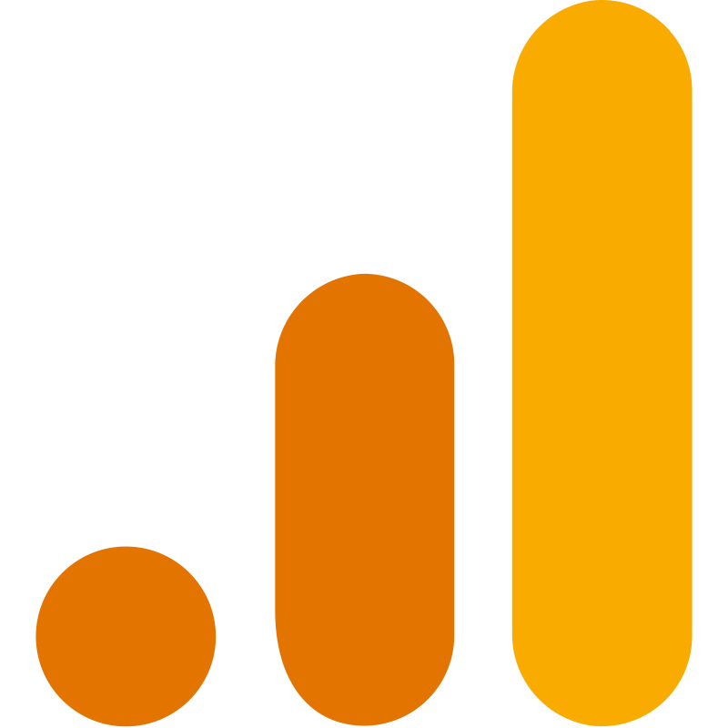
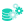
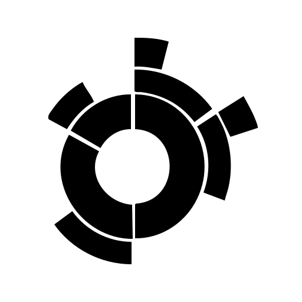
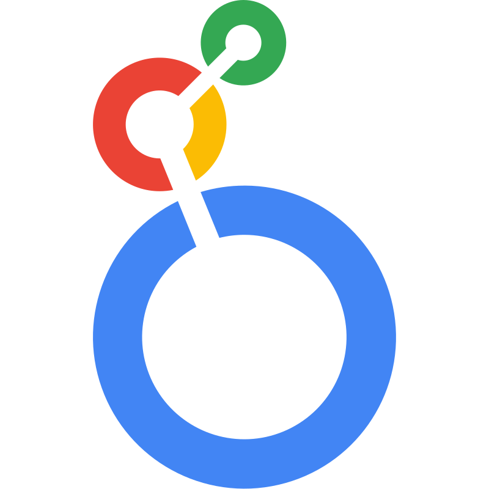

# @datama/icons

DataMa icon library with 211 icons, available as Vue 2 components and JSON data.

## Installation

```bash
npm install @datama/icons
```

## Usage

### As JSON data (for vanilla JS projects)

```javascript
import { DataMaLightIcons } from '@datama/icons';
// or
const { DataMaLightIcons } = require('@datama/icons');

// Use icon data
const checkIcon = DataMaLightIcons.check;
console.log(checkIcon.path); // SVG path data
```

### As Vue 2 components

```javascript
import Vue from 'vue';
import DatamaIcons from '@datama/icons/vue';

Vue.use(DatamaIcons);
```

```vue
<template>
  <div>
    <!-- Using specific icon component -->
    <IconCheck :size="24" fill="blue" />
    
    <!-- Using generic icon component -->
    <IconGeneric name="check" :size="24" fill="blue" />
  </div>
</template>
```

### Available props for Vue components

- `size`: Number or string (default: 24)
- `width`: Number or string (overrides size)
- `height`: Number or string (overrides size)  
- `fill`: String (default: 'currentColor')
- `stroke`: String (default: 'none')
- `strokeWidth`: Number or string (default: 0)
- `class`: String, object, or array for additional CSS classes

## Available Icons (211)

| Nom de l'icône | Aperçu |
|:-------------- |:------:|
| `add-folder-svg` |  |
| `alert-circle-svg` |  |
| `alert-triangle-svg` |  |
| `annotate-svg` |  |
| `area-chart-svg` |  |
| `areas-svg` |  |
| `arrow-bottom-svg` |  |
| `arrow-down-right-svg` |  |
| `arrow-down-svg` |  |
| `arrow-left-svg` |  |
| `arrow-right-svg` |  |
| `arrow-top-svg` |  |
| `arrow-up-right-svg` |  |
| `arrow-up-svg` |  |
| `assess-svg` |  |
| `axis-cut-svg` |  |
| `axis-svg` |  |
| `balance-scale-svg` |  |
| `bars-stacked-2-svg` |  |
| `bars-stacked-svg` |  |
| `bars-svg` |  |
| `basketball-svg` |  |
| `book-svg` |  |
| `bookmark-svg` |  |
| `books-svg` |  |
| `bug-svg` |  |
| `calendar-display-svg` |  |
| `calendar-markers-svg` |  |
| `calendar-svg` |  |
| `cards-svg` |  |
| `chat-svg` |  |
| `check-svg` |  |
| `chevron-down-svg` |  |
| `chevron-left-svg` |  |
| `chevron-right-svg` |  |
| `chevron-up-svg` |  |
| `close-svg` |  |
| `cluster-svg` |  |
| `cog-svg` |  |
| `cogs-svg` |  |
| `comment-bubble-svg` |  |
| `compare-svg` |  |
| `connector-svg` |  |
| `contacts-svg` |  |
| `copy-svg` |  |
| `cross-svg` |  |
| `csv-outline-2-svg` |  |
| `csv-outline-svg` |  |
| `csv-svg` |  |
| `cube-svg` |  |
| `data-svg` |  |
| `database-svg` |  |
| `datama-logo-svg` |  |
| `datama-svg` |  |
| `detect-svg` |  |
| `disconnect-svg` |  |
| `documentation-svg` |  |
| `documents-svg` |  |
| `download-svg` |  |
| `drop-down-1-svg` |  |
| `drop-down-svg` |  |
| `drop-left-svg` |  |
| `drop-right-svg` |  |
| `drop-up-svg` |  |
| `earth-svg` |  |
| `edit-svg` |  |
| `elements-svg` |  |
| `excel-outline-2-svg` |  |
| `excel-outline-svg` |  |
| `excel-svg` |  |
| `eyes-svg` |  |
| `facebook-svg` |  |
| `filter-svg` |  |
| `flow-svg` |  |
| `folder-open-svg` |  |
| `font-size-svg` |  |
| `font-svg` |  |
| `function-svg` |  |
| `gauge-horizontal-svg` |  |
| `gauge-svg` |  |
| `google-ads-svg` |  |
| `google-analytics-svg` |  |
| `google-bigquery-svg` |  |
| `google-drive-svg` |  |
| `google-sheets-svg` |  |
| `google-svg` |  |
| `google-trend-svg` |  |
| `graph-chart-svg` |  |
| `grid-svg` |  |
| `group-svg` |  |
| `groups-svg` |  |
| `handshake-svg` |  |
| `heart-svg` |  |
| `help-circle-svg` |  |
| `home-svg` |  |
| `illustration-analyze-slack-etc-svg` |  |
| `illustration-analyze-svg` |  |
| `illustration-anonymous-svg` |  |
| `illustration-compare-svg` |  |
| `illustration-data-svg` |  |
| `illustration-datasettings-svg` |  |
| `illustration-extension-premium-svg` |  |
| `illustration-free-svg` |  |
| `illustration-hearts-svg` |  |
| `illustration-ideas-svg` |  |
| `illustration-log-out-svg` |  |
| `illustration-premium-svg` |  |
| `inactive-sort-svg` |  |
| `include-zero-svg` |  |
| `journey-svg` |  |
| `key-svg` |  |
| `label-svg` |  |
| `leave-org-svg` |  |
| `legend-svg` |  |
| `license-key-svg` |  |
| `lines-svg` |  |
| `link-open-svg` |  |
| `link-svg` |  |
| `lock-svg` |  |
| `looker-svg` |  |
| `magnifier-svg` |  |
| `manage-billing-svg` |  |
| `manage-org-svg` |  |
| `manage-profile-svg` |  |
| `mariadb-svg` |  |
| `maximize-2-svg` |  |
| `mekko-svg` |  |
| `merge-cells-svg` |  |
| `metabase-svg` |  |
| `minus-svg` |  |
| `more-horizontal-svg` |  |
| `more-vertical-svg` |  |
| `moves-svg` |  |
| `multiply-svg` |  |
| `mysql-svg` |  |
| `new-pillar-svg` |  |
| `new-tab-svg` |  |
| `number-by-asc-svg` |  |
| `number-by-desc-svg` |  |
| `onedrive-svg` |  |
| `openai-svg` |  |
| `operator-svg` |  |
| `paint-bucket-svg` |  |
| `paint-svg` |  |
| `palette-svg` |  |
| `peace-svg` |  |
| `piano-svg` |  |
| `pivot-svg` |  |
| `play-svg` |  |
| `plus-circle-svg` |  |
| `plus-svg` |  |
| `postgresql-svg` |  |
| `power-bi-svg` |  |
| `profile-1-svg` |  |
| `profile-add-svg` |  |
| `profile-info-svg` |  |
| `profile-setting-svg` |  |
| `profile-svg` |  |
| `qlik-svg` |  |
| `ratio-svg` |  |
| `redshift-svg` |  |
| `refresh-svg` |  |
| `release-notes-1-svg` |  |
| `release-notes-svg` |  |
| `reverse-axis-svg` |  |
| `reverse-h-svg` |  |
| `reverse-v-svg` |  |
| `rotate-ccw-svg` |  |
| `rotate-ccw1-svg` |  |
| `rotate-cw-svg` |  |
| `rotate-cw1-svg` |  |
| `save-svg` |  |
| `scatter-svg` |  |
| `search-svg` |  |
| `settings-1-svg` |  |
| `settings-org-svg` |  |
| `settings-svg` |  |
| `share-2-svg` |  |
| `shopping-cart-svg` |  |
| `sidebar-toggle-svg` |  |
| `snowflake-svg` |  |
| `split-by-svg` |  |
| `stacked-svg` |  |
| `star-cool-svg` |  |
| `string-by-asc-svg` |  |
| `string-by-desc-svg` |  |
| `table-compact-svg` |  |
| `table-minimal-svg` |  |
| `table-striped-svg` |  |
| `table-svg` |  |
| `tableau-svg` |  |
| `tag-svg` |  |
| `text-color-svg` |  |
| `trash-2-svg` |  |
| `tree-hierarchy-svg` |  |
| `tree-svg` |  |
| `tutorials-svg` |  |
| `unmerge-cells-svg` |  |
| `unstacked-svg` |  |
| `update-svg` |  |
| `upload-1-svg` |  |
| `upload-svg` |  |
| `user-svg` |  |
| `value-by-asc-svg` |  |
| `value-by-desc-svg` |  |
| `warning-svg` |  |
| `waterfall-svg` |  |
| `x-svg` |  |
| `xtwitter-svg` |  |
| `zoom-in-svg` |  |
| `zoom-out-svg` |  |

## Icon Data Format

Each icon contains:

```typescript
interface IconData {
  height: number;        // SVG height (usually 1024)
  path: string;         // SVG path data
  tags: string[];       // Search tags
  ratio?: {             // Aspect ratio (optional)
    width: number;
    height: number;
  };
}
```

## Development

This package is auto-generated from SVG files. To contribute:

1. Add your SVG files to the root directory
2. Run `npm run build:all` to regenerate the package
3. The CI/CD pipeline will automatically create a new release

## License

Copyright (c) 2026 DATAMA SAS, All rights reserved.
