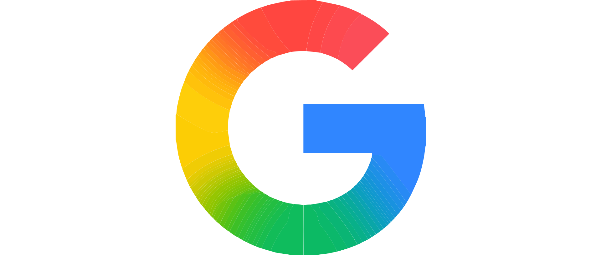

# @datama/icons

DataMa icon library with 144 icons, available as Vue 2 components and JSON data.

## Installation

```bash
npm install @datama/icons
```

## Usage

### NEW: JavaScript API (Recommended)

The library now includes a new JavaScript API (`DataMaIconsNew`) with improved functionality:

#### For ES6 Modules (import/export) - DataMa Light Project

```javascript
// Use the ES6 module version for projects with import/export
import { DataMaIconsNew } from '@datama/icons/dist/DataMaIconsNew.esm.js';

// Create an icon element
const cogIcon = DataMaIconsNew.get('cog-svg', {
    size: 32,
    fill: '#007acc'
});
document.body.appendChild(cogIcon);

// Search icons by tag
const navigationIcons = DataMaIconsNew.searchByTag('navigation');
console.log('Navigation icons:', navigationIcons);
```

#### For Script Tags (vanilla HTML)

```html
<!-- Load the vanilla JS version -->
<script src="node_modules/@datama/icons/dist/DataMaIconsNew.js"></script>

<script>
// Create an icon element
const homeIcon = DataMaIconsNew.get('home-svg', {
    size: 24,
    fill: 'currentColor'
});
document.getElementById('my-container').appendChild(homeIcon);

// Get all available icons
console.log('Available icons:', DataMaIconsNew.getAvailableIcons());
</script>
```

### Legacy: As JSON data (for vanilla JS projects)

```javascript
import { DataMaLightIconsNew } from '@datama/icons';
// or
const { DataMaLightIconsNew } = require('@datama/icons');

// Use icon data
const checkIcon = DataMaLightIconsNew['check-svg'];
console.log(checkIcon.content); // SVG content data
```

### As Vue 2 components

```javascript
import Vue from 'vue';
import DatamaIcons from '@datama/icons/vue';

Vue.use(DatamaIcons);
```

```vue
<template>
  <div>
    <!-- Using specific icon component -->
    <IconCheck :size="24" fill="blue" />
    
    <!-- Using generic icon component -->
    <IconGeneric name="check" :size="24" fill="blue" />
  </div>
</template>
```

### Available props for Vue components

- `size`: Number or string (default: 24)
- `width`: Number or string (overrides size)
- `height`: Number or string (overrides size)  
- `fill`: String (default: 'currentColor')
- `stroke`: String (default: 'none')
- `strokeWidth`: Number or string (default: 0)
- `class`: String, object, or array for additional CSS classes

### DataMaIconsNew API Methods

The new JavaScript API provides these methods:

```javascript
// Get an icon as DOM element
DataMaIconsNew.get(iconName, options)

// Get all available icon names
DataMaIconsNew.getAvailableIcons()

// Search icons by tag
DataMaIconsNew.searchByTag(tagName)

// Get icon raw data
DataMaIconsNew.getIconData(iconName)

// Generate SVG as string
DataMaIconsNew.toSvg(iconName, options)

// Replace data-datama attributes in DOM
DataMaIconsNew.replace(options)
```

#### Options for `get()` and `toSvg()` methods:

- `size`: Number (default: 24) - Sets both width and height
- `width`: Number - Override width specifically  
- `height`: Number - Override height specifically
- `fill`: String (default: 'currentColor') - Icon color, use 'original' for original colors
- `stroke`: String (default: 'none') - Stroke color
- `strokeWidth`: Number (default: 0) - Stroke width
- `className`: String - CSS class name(s)
- `invert`: Boolean (default: false) - Invert colors (white ↔ colored)

## Available Icons (144)

| Nom de l'icône | Aperçu |
|:-------------- |:------:|
| `add-folder-svg` |  |
| `alert-circle-svg` |  |
| `alert-triangle-svg` |  |
| `area-chart-svg` |  |
| `arrow-bottom-svg` |  |
| `arrow-down-right-svg` |  |
| `arrow-left-svg` |  |
| `arrow-right-svg` |  |
| `arrow-top-svg` |  |
| `arrow-up-right-svg` |  |
| `assess-svg` |  |
| `balance-scale-svg` |  |
| `books-svg` |  |
| `chat-svg` |  |
| `check-svg` |  |
| `chevron-down-svg` |  |
| `chevron-left-svg` |  |
| `chevron-right-svg` |  |
| `chevron-up-svg` |  |
| `close-svg` |  |
| `cog-svg` |  |
| `compare-svg` |  |
| `contacts-svg` |  |
| `copy-svg` |  |
| `cross-svg` |  |
| `csv-outline-2-svg` |  |
| `csv-outline-svg` |  |
| `csv-svg` |  |
| `data-svg` |  |
| `database-svg` |  |
| `datama-logo-svg` |  |
| `datama-svg` |  |
| `detect-svg` |  |
| `documentation-svg` |  |
| `documents-svg` |  |
| `download-svg` |  |
| `drop-down-1-svg` |  |
| `drop-down-svg` |  |
| `drop-left-svg` |  |
| `drop-right-svg` |  |
| `drop-up-svg` |  |
| `earth-svg` |  |
| `edit-svg` |  |
| `excel-outline-2-svg` |  |
| `excel-outline-svg` |  |
| `excel-svg` |  |
| `eyes-svg` |  |
| `facebook-svg` |  |
| `filter-svg` |  |
| `flow-svg` |  |
| `folder-open-svg` |  |
| `font-svg` |  |
| `function-svg` |  |
| `gauge-svg` |  |
| `google-ads-svg` |  |
| `google-analytics-svg` |  |
| `google-bigquery-svg` |  |
| `google-drive-svg` |  |
| `google-sheets-svg` |  |
| `google-svg` |  |
| `google-trend-svg` |  |
| `graph-chart-svg` |  |
| `group-svg` |  |
| `groups-svg` |  |
| `handshake-svg` |  |
| `heart-svg` |  |
| `help-circle-svg` |  |
| `home-svg` |  |
| `illustration-analyze-slack-etc-svg` |  |
| `illustration-analyze-svg` |  |
| `illustration-anonymous-svg` |  |
| `illustration-compare-svg` |  |
| `illustration-data-svg` |  |
| `illustration-datasettings-svg` |  |
| `illustration-extension-premium-svg` |  |
| `illustration-free-svg` |  |
| `illustration-hearts-svg` |  |
| `illustration-ideas-svg` |  |
| `illustration-log-out-svg` |  |
| `illustration-premium-svg` |  |
| `journey-svg` |  |
| `key-svg` |  |
| `label-svg` |  |
| `leave-org-svg` |  |
| `license-key-svg` |  |
| `link-open-svg` |  |
| `link-svg` |  |
| `lock-svg` |  |
| `looker-svg` |  |
| `magnifier-svg` |  |
| `mariadb-svg` |  |
| `maximize-2-svg` |  |
| `minus-svg` |  |
| `more-horizontal-svg` |  |
| `more-vertical-svg` |  |
| `mysql-svg` |  |
| `new-tab-svg` |  |
| `onedrive-svg` |  |
| `openai-svg` |  |
| `paint-svg` |  |
| `peace-svg` |  |
| `piano-svg` |  |
| `pivot-svg` |  |
| `play-svg` |  |
| `plus-svg` |  |
| `postgresql-svg` |  |
| `power-bi-svg` |  |
| `profile-1-svg` |  |
| `profile-add-svg` |  |
| `profile-info-svg` |  |
| `profile-setting-svg` |  |
| `profile-svg` |  |
| `qlik-svg` |  |
| `redshift-svg` |  |
| `release-notes-1-svg` |  |
| `release-notes-svg` |  |
| `reverse-axis-svg` |  |
| `rotate-ccw-svg` |  |
| `rotate-ccw1-svg` |  |
| `rotate-cw-svg` |  |
| `rotate-cw1-svg` |  |
| `save-svg` |  |
| `search-svg` |  |
| `settings-1-svg` |  |
| `settings-org-svg` |  |
| `settings-svg` |  |
| `share-2-svg` |  |
| `shopping-cart-svg` |  |
| `snowflake-svg` |  |
| `stacked-svg` |  |
| `star-cool-svg` |  |
| `table-svg` |  |
| `tableau-svg` |  |
| `text-color-svg` |  |
| `trash-2-svg` |  |
| `tree-svg` |  |
| `tutorials-svg` |  |
| `unstacked-svg` |  |
| `update-svg` |  |
| `upload-1-svg` |  |
| `upload-svg` |  |
| `warning-svg` |  |
| `x-svg` |  |
| `xtwitter-svg` |  |

## File Structure

The package includes multiple distribution formats:

- **`DataMaIconsNew.js`** - Vanilla JavaScript for `<script>` tags
- **`DataMaIconsNew.esm.js`** - ES6 module for `import/export` (use this for DataMa Light project)
- **`icons.json`** - Raw icon data as JSON
- **`vue/`** - Vue 2 components

## Icon Data Format

Each icon contains:

```typescript
interface IconData {
  height: number;        // SVG height (usually 24)
  width: number;         // SVG width (usually 24) 
  viewBox: string;       // SVG viewBox
  isComplex: boolean;    // Whether icon has complex styling
  category: string;      // Icon category (actions, data, light, ui, etc.)
  content: string;       // SVG content for complex icons
  path?: string;         // SVG path data for simple icons
  tags: string[];        // Search tags
  originalDimensions: {  // Original SVG dimensions
    width: number;
    height: number;
  };
}
```

## Migration from Legacy API

If you're migrating from the old API:

```javascript
// OLD
const iconData = DataMaLightIcons['check'];
// Create your own SVG element

// NEW
const iconElement = DataMaIconsNew.get('check-svg', { size: 24 });
// Ready-to-use DOM element
```

## Development

This package is auto-generated from SVG files. To contribute:

1. Add your SVG files to the `icons/` directory (organized by category)
2. Run `npm run build:all` to regenerate the package
3. The CI/CD pipeline will automatically create a new release

### Development Commands

```bash
npm run build:svg     # Process SVG files
npm run build:json    # Generate JSON data
npm run build:vue     # Generate Vue components  
npm run build         # Generate distribution files
npm run build:all     # Full build process
```

## Important Notes

### For DataMa Light Project

Always use the **ES6 module version** (`DataMaIconsNew.esm.js`) when working with the DataMa Light project:

```javascript
// ✅ Correct for DataMa Light
import { DataMaIconsNew } from '../components/DataMaIconsNew.esm.js';

// ❌ Don't use this in DataMa Light (causes import errors)
import { DataMaIconsNew } from '../components/DataMaIconsNew.js';
```

### Icon Naming Convention

All icons follow the pattern `{name}-svg` (e.g., `cog-svg`, `home-svg`, `settings-svg`)

## License

Copyright (c) 2025 DATAMA SAS, All rights reserved.
