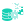

# @datama/icons

DataMa icon library with 136 icons, available as Vue 2 components and JSON data.

## Installation

```bash
npm install @datama/icons
```

## Usage

### As JSON data (for vanilla JS projects)

```javascript
import { DataMaLightIcons } from '@datama/icons';
// or
const { DataMaLightIcons } = require('@datama/icons');

// Use icon data
const checkIcon = DataMaLightIcons.check;
console.log(checkIcon.path); // SVG path data
```

### As Vue 2 components

```javascript
import Vue from 'vue';
import DatamaIcons from '@datama/icons/vue';

Vue.use(DatamaIcons);
```

```vue
<template>
  <div>
    <!-- Using specific icon component -->
    <IconCheck :size="24" fill="blue" />
    
    <!-- Using generic icon component -->
    <IconGeneric name="check" :size="24" fill="blue" />
  </div>
</template>
```

### Available props for Vue components

- `size`: Number or string (default: 24)
- `width`: Number or string (overrides size)
- `height`: Number or string (overrides size)  
- `fill`: String (default: 'currentColor')
- `stroke`: String (default: 'none')
- `strokeWidth`: Number or string (default: 0)
- `class`: String, object, or array for additional CSS classes

## Available Icons

| Nom de l'icône | Aperçu |
|:-------------- |:------:|
| settings.svg |  |
| flow.svg |  |
| shopping_cart.svg |  |
| star - cool.svg |  |
| tutorials.svg |  |
| warning.svg |  |
| profile-add.svg |  |
| profile-info.svg |  |
| profile-setting.svg |  |
| profile.svg |  |
| release-notes-1.svg |  |
| release-notes.svg |  |
| search.svg |  |
| settings-1.svg |  |
| settings-org.svg |  |
| eyes.svg |  |
| folder_open.svg |  |
| group.svg |  |
| groups.svg |  |
| home.svg |  |
| license-key.svg |  |
| link-open.svg |  |
| lock.svg |  |
| plus.svg |  |
| profile-1.svg |  |
| check.svg |  |
| contacts.svg |  |
| copy.svg |  |
| cross.svg |  |
| documentation.svg |  |
| documents.svg |  |
| earth.svg |  |
| edit.svg |  |
| redshift.svg |  |
| google-sheets.svg |  |
| excel.svg |  |
| piano.svg |  |
| google-trend.svg |  |
| xtwitter.svg |  |
| google.svg |  |
| tableau.svg |  |
| looker.svg |  |
| onedrive.svg |  |
| power-bi.svg |  |
| snowflake.svg |  |
| facebook.svg |  |
| google-ads.svg |  |
| google-analytics.svg |  |
| google-bigquery.svg |  |
| google-drive.svg |  |
| csv.svg |  |
| database.svg |  |
| journey.svg |  |
| Pivot.svg |  |
| data.svg |  |
| graph-chart.svg |  |
| illustration-extension-premium.svg |  |
| illustration-free.svg |  |
| illustration-hearts.svg |  |
| illustration-ideas.svg |  |
| illustration-log-out.svg |  |
| illustration-premium.svg |  |
| illustration-analyze-slack-etc.svg |  |
| illustration-analyze.svg |  |
| illustration-anonymous.svg |  |
| illustration-compare.svg |  |
| illustration-data.svg |  |
| illustration-datasettings.svg |  |
| unstacked.svg |  |
| x.svg |  |
| stacked.svg |  |
| table.svg |  |
| text-color.svg |  |
| trash-2.svg |  |
| tree.svg |  |
| rotate-ccw1.svg |  |
| rotate-cw.svg |  |
| rotate-cw1.svg |  |
| save.svg |  |
| settings.svg |  |
| share-2.svg |  |
| play.svg |  |
| plus.svg |  |
| reverse-axis.svg |  |
| rotate-ccw.svg |  |
| more-horizontal.svg |  |
| more-vertical.svg |  |
| new-tab.svg |  |
| paint.svg |  |
| peace.svg |  |
| link.svg |  |
| lock.svg |  |
| magnifier.svg |  |
| maximize-2.svg |  |
| minus.svg |  |
| handshake.svg |  |
| heart.svg |  |
| help-circle.svg |  |
| key.svg |  |
| label.svg |  |
| download.svg |  |
| edit.svg |  |
| filter.svg |  |
| font.svg |  |
| function.svg |  |
| gauge.svg |  |
| close.svg |  |
| cog.svg |  |
| copy.svg |  |
| datama.svg |  |
| chevron-down.svg |  |
| chevron-left.svg |  |
| chevron-right.svg |  |
| chevron-up.svg |  |
| arrow-top.svg |  |
| arrow-up-right.svg |  |
| balance-scale.svg |  |
| books.svg |  |
| chat.svg |  |
| check.svg |  |
| arrow-down-right.svg |  |
| arrow-left.svg |  |
| arrow-right.svg |  |
| alert-triangle.svg |  |
| area-chart.svg |  |
| arrow-bottom.svg |  |
| alert-circle.svg |  |
| qlik.svg |  |
| datama-logo.svg |  |
| drop-down-1.svg |  |
| drop-down.svg |  |
| drop-left.svg |  |
| drop-right.svg |  |
| drop-up.svg |  |

## Icon Data Format

Each icon contains:

```typescript
interface IconData {
  height: number;        // SVG height (usually 1024)
  path: string;         // SVG path data
  tags: string[];       // Search tags
  ratio?: {             // Aspect ratio (optional)
    width: number;
    height: number;
  };
}
```

## Development

This package is auto-generated from SVG files. To contribute:

1. Add your SVG files to the root directory
2. Run `npm run build:all` to regenerate the package
3. The CI/CD pipeline will automatically create a new release

## License

Copyright (c) 2025 DATAMA SAS, All rights reserved.

